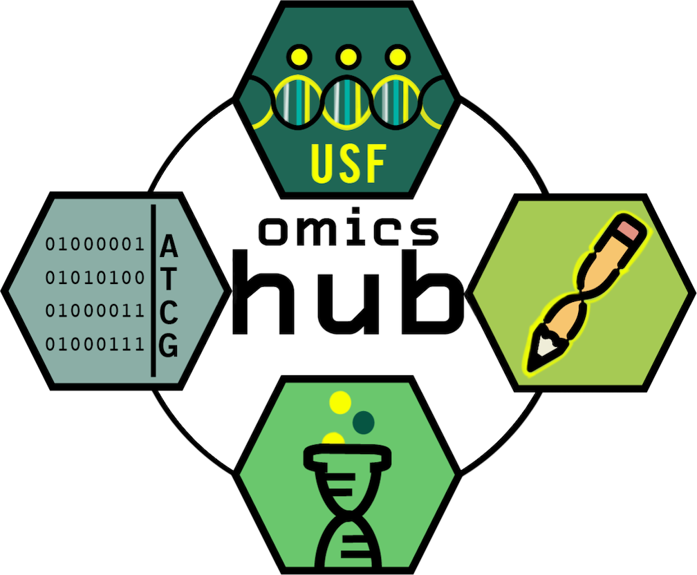

<html>
<body>

<h1 align="center">Welcome to the USF Omics Hub git repository!</h1>

  

  
   
  <h3 align="center">We post our materials for our data-analysis workshops here, as well as the code we've developed for various other omics-related data analyses.</h3>
   
 

  <b> See our <a href="https://github.com/usfomicshub/usfomicshub.github.io/wiki">Wiki</a> page for documentation, walkthroughs for our pipelines, and other helpful information. See our <a href="https://github.com/JustinGibbons/USF_Omics_Hub/wiki/FAQ">FAQ</a> for answers to common questions about the Omics Hub. More updates coming soon! </b>
   
   
   

  <b> Other useful links:</b> 
  <a href="https://health.usf.edu/publichealth/ghidr/genomics">USF Genomics Home</a> |
  <a href="https://health.usf.edu/publichealth/ghidr/genomics/request-services"> Hub service inquiries </a>
   
  <a href="https://wiki.rc.usf.edu/index.php/Main_Page"> USF Research Computing Home* </a> |
  <a href="https://wiki.rc.usf.edu/index.php/Software_and_Libraries"> USF Research Computing: Available software* </a>

<h6> * requires USF NetID login </h6>
</body>
</html>
